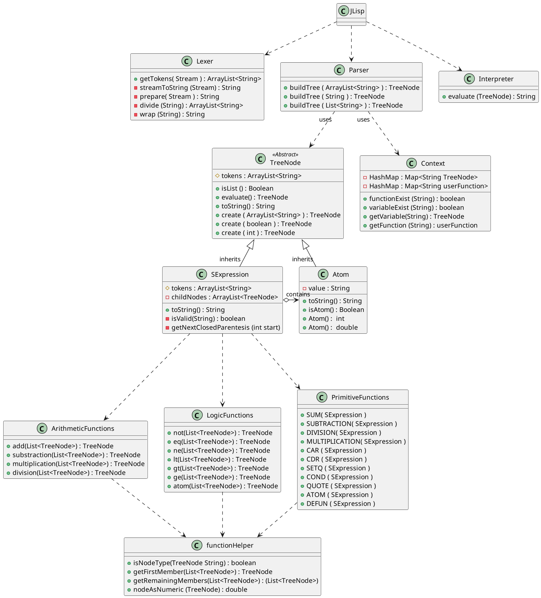

<h1 align="center">
    
    <h1 align="center" style="font-style:italic;">JLisp</h1>
    <h5 align="center">
    <i style="color:grey;"> Una pequeña implementacion de Lisp en Java</i>
    </h5>

</h1>

Elaborado con java 17 y maven.

**Código fuente:**  [***Aquí***](https://github.com/DiegoLinares11/LISP-Project/tree/master/src/main/java/org/project)  

**Unit Test:** [***Aquí***](https://github.com/DiegoLinares11/LISP-Project/tree/master/src/test/java/org/project)  

## Indice

- [Guia de Uso](#guia-de-uso)
  
  - [Problemas en Windows](#problemas-en-windows)

- [¿Como funciona?](#como-funciona)

## Guia de Uso

1. Descargar este repositorio.

2. En un archivo escribir el código Lisp a interpretar
   
   ```lisp
   ;./Fibonacci.lisp, (Copiar sin los comentarios).
   
   (defun fibonacci (n)
       (cond
           ((< n 2) n)
           (T ( + (fibonacci (- n 1)) (fibonacci (- n 2))))
       )
   )
   
   (print (fibonacci 5))
   ; Prints 5
   ```

3. Ejecutar  `JLisp.jar` pasando el archivo a interpretar como argumento.
   
   ```bash
   java -jar ./JLisp.jar <codigo.lisp>
   Ejemplo
   java -jar ./JLisp.jar ./Fibonacci.lisp
   ```

#### Problemas en Windows

Antes de ejecutarlo, asegurarse que el Java(TM) Platform SE binary, esta activado. 


## ¿Como funciona?

Todo esta explicado con detalle en la  [**WIKI**](https://github.com/DiegoLinares11/LISP-Project/wiki) :question:

Pero para empezar el interpreta se compone de 3 partes principales

1. **Lexer**: Rompe una expresion dado en palabras significativas llamadas *"tokens"*

2. **Parser**: Recibe una lista de *tokens* y los analiza segun unas reglas gramáticas, para luego construir *"árboles de nodos"* que representan instrucciones que si pueden ser ejecutadas por java ( o el lenguaje que se desee).

3. **Interpreter**: Recibe arboles de instrucciones y los ejecuta.

A continuacion puedes ver un Diagrama UML de todas las clases y como se relacionan entre ellas:


